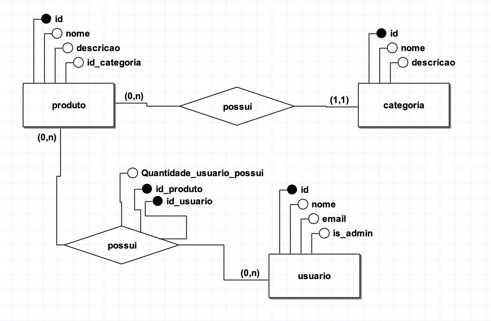

# loja_de_roupa_Fullstack
Este trabalho acadêmico propõe a implementação de uma loja virtual de vestuário, empregando Flask como framework para o backend, Mysql como banco de dados, e tecnologias web (HTML, CSS, JavaScript e Bootstrap) para o frontend. O projeto visa demonstrar a integração dessas ferramentas no desenvolvimento de uma plataforma de comércio eletrônico funcional e visualmente atrativa.



## Bibliotecas utilizadas
```python
alembic==1.7.7
aniso8601==9.0.1
click==8.1.3
colorama==0.4.4
Flask==2.1.2
Flask-JWT-Extended==4.4.0
flask-marshmallow==0.14.0
Flask-Migrate==2.5.2
Flask-RESTful==0.3.9
Flask-SQLAlchemy==2.5.1
greenlet==1.1.2
gunicorn==20.1.0
importlib-metadata==4.11.3
itsdangerous==2.1.2
Jinja2==3.1.2
Mako==1.2.0
MarkupSafe==2.1.1
marshmallow==3.15.0
marshmallow-sqlalchemy==0.28.0
packaging==21.3
passlib==1.7.4
psycopg2==2.9.3
PyJWT==2.4.0
pyparsing==3.0.8
pytz==2022.1
six==1.16.0
SQLAlchemy==1.4.36
Werkzeug==2.1.2
zipp==3.8.0
msqlclient (Caso nao funcione, utilizar **mysql-connector-python** )
```

## Script de instalacao
```
pip install alembic==1.7.7 aniso8601==9.0.1 click==8.1.3 colorama==0.4.4 Flask==2.1.2 Flask-JWT-Extended==4.4.0 flask-marshmallow==0.14.0 Flask-Migrate==2.5.2 Flask-RESTful==0.3.9 Flask-SQLAlchemy==2.5.1 greenlet==1.1.2 gunicorn==20.1.0 importlib-metadata==4.11.3 itsdangerous==2.1.2 Jinja2==3.1.2 Mako==1.2.0 MarkupSafe==2.1.1 marshmallow==3.15.0 marshmallow-sqlalchemy==0.28.0 packaging==21.3 passlib==1.7.4 psycopg2==2.9.3 PyJWT==2.4.0 pyparsing==3.0.8 pytz==2022.1 six==1.16.0 SQLAlchemy==1.4.36 Werkzeug==2.1.2 zipp==3.8.0 mysql-connector-python pymysql
```

## Bibliotecas de authenticacao
```
Flask-JWT_Extended 4.4.0
passlib 1.7.7.4
```

## importar variaveis de ambiente para o uso do migrate
### para Linux/MacOS
```
export FLASK_APP=api.py
echo $FLASK_APP
```
### para windows
```
FLASK_APP=api.py.
```

### remomeie o arquivo configOLD.py para config.py, e adicione suas chaves da AWS

